Hello 👋, I am a self-taught software engineer from Germany who has been fascinated with IT since 2008.

I like:
- 🔓 FOSS
- 🌐 Decentralised platforms
- 🔰 Digital sovereignty
- 🪩 Demoscene
- ⚡ Microelectronics
- 🛠️ DIY
- 🌱 Permaculture

I dislike:
- 🍅 Tomatoes
- 🙅‍♀️ Undefined behaviour
- 💢 Cynicism
- ✨ AI Slop & Vibe Coding

## Socials

- <a rel="me" target="_blank" href="https://shadertoy.com/user/lara"> Shadertoy</a>
- <a rel="me" target="_blank" href="https://mastodon.social/@literallylara"> Mastodon</a>
- <a rel="me" target="_blank" href="https://www.printables.com/@literallylara"> Printables</a>
- <a rel="me" target="_blank" href="https://sketchfab.com/literallylara"> Sketchfab</a>

## Shaders

| 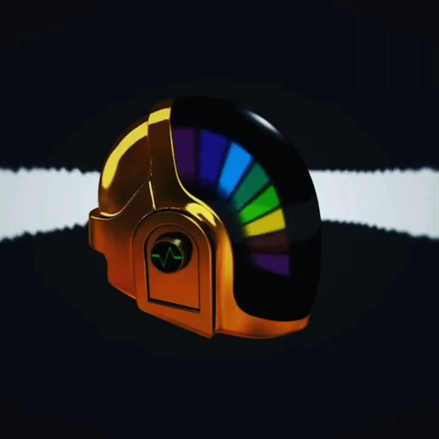 | **Daft Punk - Guy Helmet • [View on Shadertoy](https://shadertoy.com/view/4ldSWB) • [Video (no audio)](./assets/shaders/daft-punk_no-audio.webm)** | 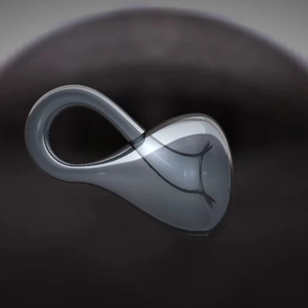 | **Klein Bottle • [View on Shadertoy](https://www.shadertoy.com/view/4ltSW8) • [Video](./assets/shaders/klein-bottle.webm)** |
|:-|:-|:-|:-|
| 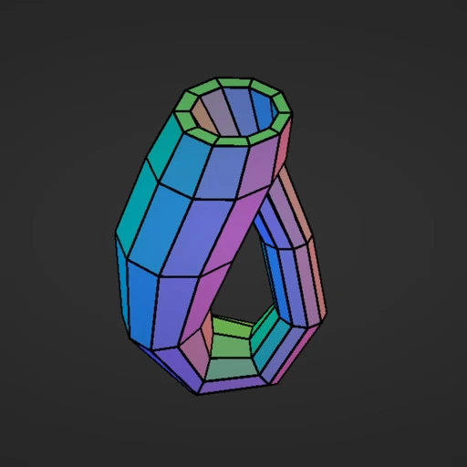 | **Parametric Surface Plotter • [View on Shadertoy](https://www.shadertoy.com/view/XttSW8) • [Video](./assets/shaders/parametric-surface-plotter.webm)** | 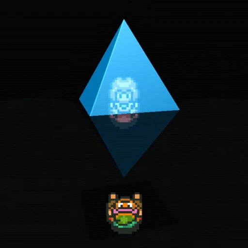 | **Link to the Past • [View on Shadertoy](https://www.shadertoy.com/view/llcGDf) • [Video](./assets/shaders/lttp.webm)** |

## Competition Entries

|  | **Coral Reef** • [View on JS1K](https://js1k.com/2596) • [Video](./assets/js1k/coral-reef.webm) | 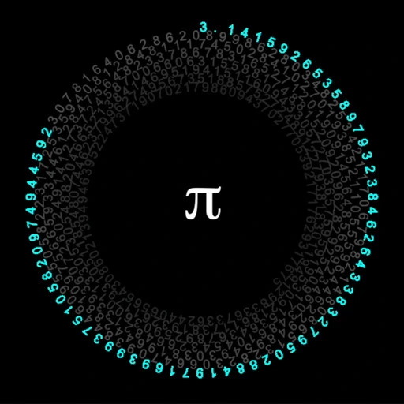 | **Pi Major** • [View on JS1K](https://js1k.com/2482) • [Video](./assets/js1k/pi-major.webm) |
|:-|:-|:-|:-|
| 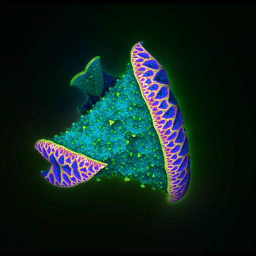 | **Romanesco 2.0 • [View on JS1K](https://js1k.com/2552) • [Video](./assets/js1k/romanesco.webm)** | | |

## CAD Models

| 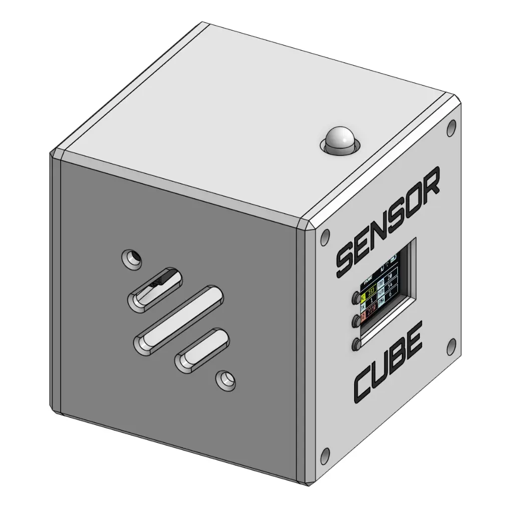 | **Sensor Cube • [View on Printables](https://www.printables.com/model/1529426-sensor-cube) • [View on Codeberg](https://codeberg.org/literallylara/SensorCube)** | 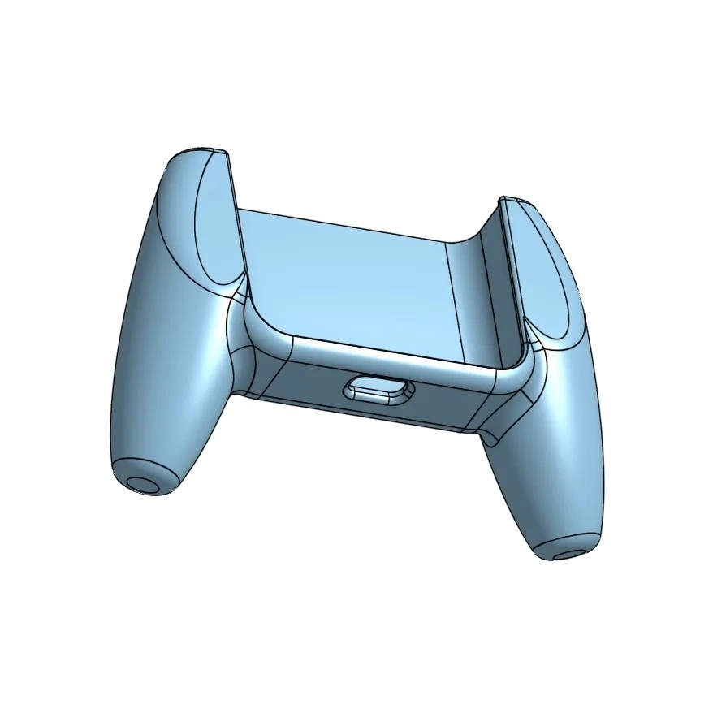 | **Anbernic RG353V/S Grip • [View on Printables](https://www.printables.com/model/469500-anbernic-rg353vs-grip)** |
|:-|:-|:-|:-|
| 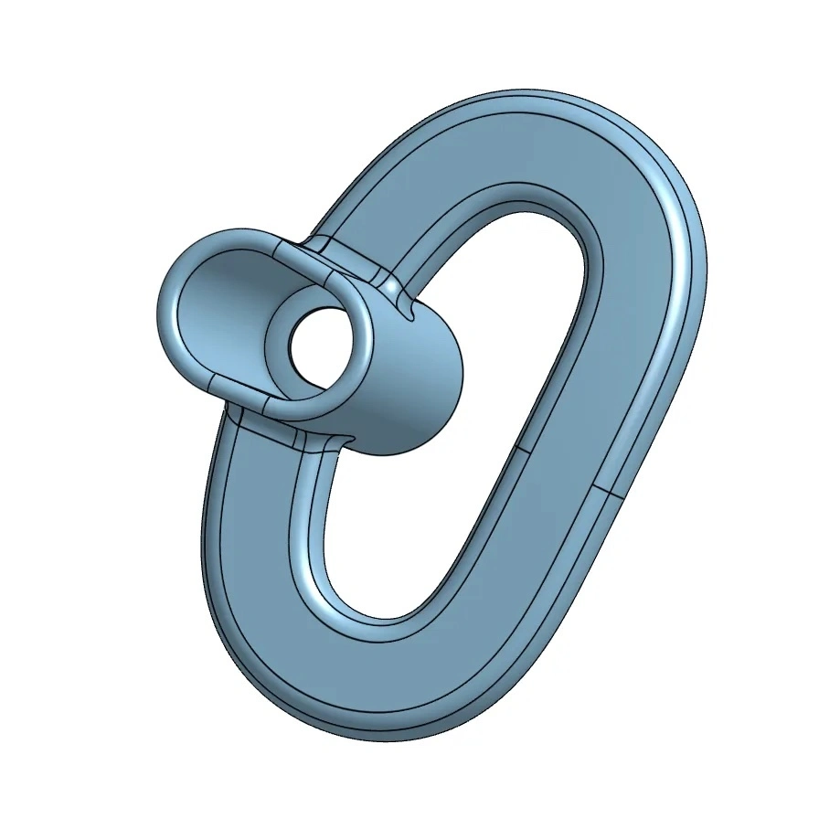 | **WaterRower Handle/Grip • [View on Printables](https://www.printables.com/model/461556-waterrower-handlegrip) ** | | |

## Mesh Models

| 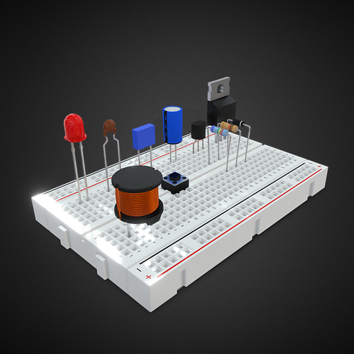 | **Set of Electronic Components • [View on Sketchfab](https://skfb.ly/6XnzP)** | 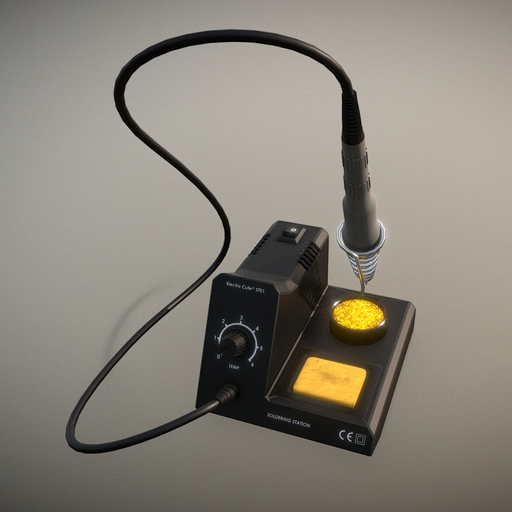 | **Generic Soldering Station • [View on Sketchfab](https://skfb.ly/6WRUn)** |
|:-|:-|:-|:-|
| 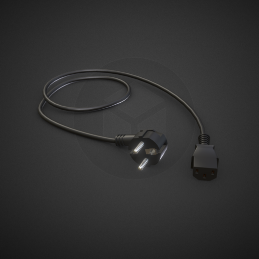 | **European Power Plug • [View on Sketchfab](https://skfb.ly/6WVvZ)** | 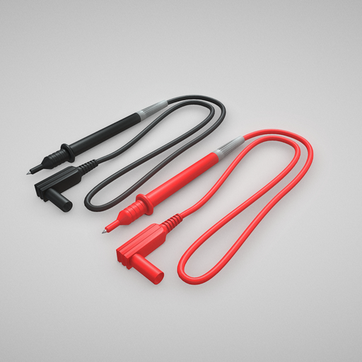 | **Safety Banana Plug Cable with Test Probe • [View on Sketchfab](https://skfb.ly/6XnnD)** |
